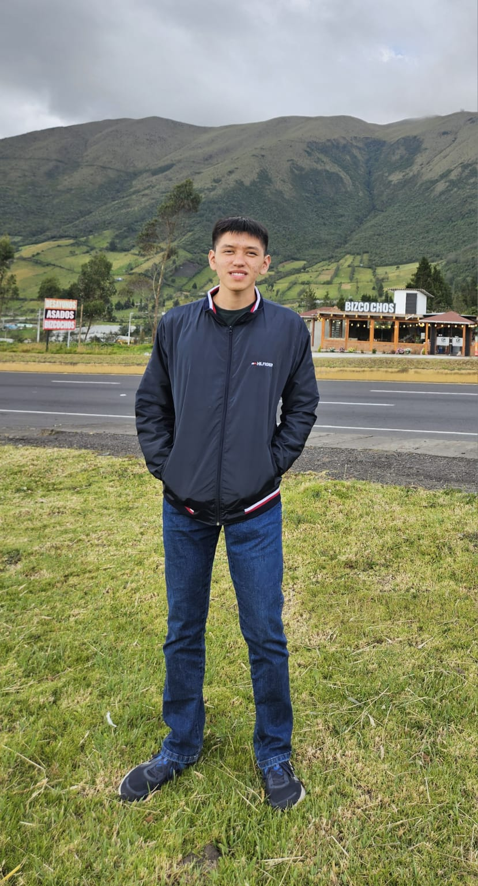

# SafeStreets — Monitor de Segurança Urbana

**SafeStreets** é uma aplicação voltada ao monitoramento inteligente de riscos urbanos a partir da análise de notícias e dados públicos de segurança pública do Distrito Federal.

O sistema combina **coleta de dados em tempo real**, **inteligência artificial** e **visualização geoespacial** para oferecer ao cidadão uma visão clara e atualizada sobre a segurança de cada região administrativa.

---

## 🎯 Objetivo

Transformar dados brutos de segurança pública em **informação útil e acessível**, auxiliando cidadãos, gestores e pesquisadores na compreensão do cenário urbano — e apoiando decisões mais conscientes no dia a dia.

---

## 🔍 Principais Funcionalidades

| Funcionalidade | Descrição |
|---|---|
| 🗺️ **Mapa Interativo** | Exibe ocorrências criminais em tempo real georreferenciadas no DF |
| 📰 **Feed de Notícias** | Coleta e apresenta notícias sobre segurança pública de fontes externas |
| 🤖 **Resumo por IA** | Gera, automaticamente, um resumo da situação de segurança de uma região ao selecioná-la |
| 📊 **Dashboard Analítico** | Painel com gráficos e indicadores estatísticos por região e período |
| 🔎 **Filtros Avançados** | Busca por Região Administrativa (RA) e intervalo de datas |

---

## 🏗️ Visão Geral da Arquitetura

O SafeStreets adota uma **Arquitetura em Camadas** (*Layered Architecture*), garantindo clareza na separação de responsabilidades e facilitando a manutenção e escalabilidade do sistema.

```
Frontend (Next.js)
       │ REST API (HTTPS)
       ▼
Backend (FastAPI · Python)
  ├── routers/     → Endpoints da API
  ├── services/    → Regras de negócio e IA
  └── repositories/→ Acesso ao banco de dados
       │
       ▼
PostgreSQL (Docker)
```

A comunicação entre camadas segue o padrão **Jamstack**: o frontend consome dados exclusivamente via API RESTful, sem acoplamento direto ao banco de dados.

> 📄 Veja mais detalhes em [Arquitetura](arquitetura/definir-arquitetura.md) · [Stack Back-end](arquitetura/definições-de-back.md) · [Stack Front-end](arquitetura/definicoes-front-end.md)

---

## 💻 Frontend
| Tecnologia | Função |
|---|---|
| **Next.js** | Framework React com SSR/SSG |
| **TypeScript + JSX** | Linguagem tipada para interfaces |
| **CSS Modules** | Estilização com escopo local |

## 💾 Backend
| Tecnologia | Função |
|---|---|
| **Python + FastAPI** | Framework principal da API REST |
| **PostgreSQL** | Banco de dados relacional |
| **SQLAlchemy** | ORM para acesso ao banco |
| **Docker** | Containerização do ambiente |
| **Swagger / OpenAPI** | Documentação automática da API |

---

## 📋 Requisitos do Sistema

O projeto está organizado em **4 Épicos principais**:

1. **Épico 1 — Visualização de Notícias:** Feed de segurança pública com detalhamento de ocorrências.
2. **Épico 2 — Mapeamento e Alertas:** Mapa interativo com marcadores e cards de risco.
3. **Épico 3 — Dashboard / Filtros:** Painel estatístico com busca por RA e período.
4. **Épico 4 — Backend / API:** Endpoints REST, scraping automático e integração com IA.

**Requisitos Não Funcionais de destaque:**

- ⚡ Carregamento assíncrono do feed de notícias
- 🔒 Tráfego exclusivamente via HTTPS
- 🖥️ Interface otimizada para Desktop/Web
- 🏗️ Separação estrita entre Frontend e Backend (Jamstack)

> 📄 Veja a lista completa em [Requisitos Funcionais e Não Funcionais](Requisitos/requisitos.md)

---

## 🎨 Design e Prototipação

O design do SafeStreets foi planejado para oferecer uma experiência **moderna, intuitiva e acessível**. O protótipo de alta fidelidade, desenvolvido no Figma, representa fielmente as telas, componentes, tipografia e fluxo de navegação do sistema antes do desenvolvimento definitivo.

**Telas mapeadas no protótipo:**

- Tela inicial com feed de notícias
- Mapa interativo com marcadores de risco
- Painel de informações e alertas urbanos
- Dashboard estatístico com filtros

> 🎨 Veja o [Protótipo de Alta Fidelidade](Design/prototipo_alta_fidelidade.md) · [Acesse no Figma](https://www.figma.com/design/ELsAXrAg9XaFQ8MODp3tdA/Prot%C3%B3tipo-de-alta-fidelidade-SafeStreets?node-id=0-1&t=glD8oRKzVZZU0SkK-1)

---

## 🗂️ Planejamento e Métodos Ágeis

O time adota **Scrum** com entregas semanais, quadro Kanban para gestão de tarefas e Story Map para alinhamento de escopo. Toda a rastreabilidade é mantida via GitHub Issues e Pull Requests.

> 📄 Veja mais em [Métodos Ágeis](metodos_ageis/organizar_kanban.md)

---

## 🚀 Histórico de Releases

| Versão | Destaques |
|---|---|
| **v0.1.0** | Protótipo de alta fidelidade · Implementação da API · Banco de dados com PostgreSQL + Docker · Documentação MkDocs · Modularização de rotas |

> 📄 Veja as notas completas em [Release v0.1.0](Releases/conteudo_releasenote_v0.1.0.md)

---

## 👥 Equipe — Squad 01 · MDS-01/2026

<style>
.team-grid {
  display: flex;
  flex-wrap: wrap;
  gap: 32px;
  margin-top: 20px;
  justify-content: center;
}
.team-member {
  display: flex;
  flex-direction: column;
  align-items: center;
  width: 130px;
  text-align: center;
}
.team-member img {
  width: 110px;
  height: 110px;
  border-radius: 50%;
  border: 3px solid #2e7d32;
  object-fit: cover;
  object-position: center top;
  display: block;
  margin: 0 auto 8px;
}
.team-member strong {
  display: block;
  font-size: 0.85rem;
  margin-bottom: 4px;
}
.team-member a {
  font-size: 0.78rem;
}
</style>

<div class="team-grid">

  <div class="team-member">
    
    <strong>Arthur Feitosa</strong>
    <a href="https://github.com/ArthurFeitosa05" target="_blank">@ArthurFeitosa05</a>
  </div>

  <div class="team-member">
    
    <strong>Edson Gabriel</strong>
    <a href="https://github.com/EdsonToppzera" target="_blank">@EdsonToppzera</a>
  </div>

  <div class="team-member">
    
    <strong>Israel Soares</strong>
    <a href="https://github.com/IsraelSoares-25" target="_blank">@IsraelSoares-25</a>
  </div>

  <div class="team-member">
    
    <strong>Matheus Queiroz</strong>
    <a href="https://github.com/matheusqsa" target="_blank">@matheusqsa</a>
  </div>

  <div class="team-member">
    
    <strong>Jorge Vasquez</strong>
    <a href="https://github.com/jorgevasquez25" target="_blank">@jorgevasquez25</a>
  </div>

  <div class="team-member">
    
    <strong>Nicolas Lopes</strong>
    <a href="https://github.com/Nic0laslc" target="_blank">@Nic0laslc</a>
  </div>

</div>

---

## 🔗 Links Úteis

| Recurso | Link |
|---|---|
| 📂 Repositório GitHub | [unb-mds/2026-1-SafeStreets](https://github.com/unb-mds/2026-1-SafeStreets) |
| 🎨 Protótipo Figma | [Alta Fidelidade](https://www.figma.com/design/ELsAXrAg9XaFQ8MODp3tdA/Prot%C3%B3tipo-de-alta-fidelidade-SafeStreets) |
| 🗺️ Story Map | [Figma — Squad 1](https://www.figma.com/board/13SnyvGleeaYsubnOhMeYk/Template-MDS-Squad-1) |
| 📋 Backlog / Issues | [GitHub Issues](https://github.com/unb-mds/2026-1-SafeStreets/issues) |
| 📈 Dashboard de Produtividade | [Dashboard](https://unb-mds.github.io/2026-1-SafeStreets/productivity/) |